---
## Front matter
title: "Теплопроводность, детерминированное горение"
subtitle: "Этап № 1"

## Generic otions
lang: ru-RU
toc-title: "Содержание"

## Bibliography
bibliography: bib/cite.bib
csl: pandoc/csl/gost-r-7-0-5-2008-numeric.csl

## Pdf output format
toc: true # Table of contents
toc-depth: 2
lof: true # List of figures
lot: true # List of tables
fontsize: 12pt
linestretch: 1.5
papersize: a4
documentclass: scrreprt
## I18n polyglossia
polyglossia-lang:
  name: russian
  options:
	- spelling=modern
	- babelshorthands=true
polyglossia-otherlangs:
  name: english
## I18n babel
babel-lang: russian
babel-otherlangs: english
## Fonts
mainfont: IBM Plex Serif
romanfont: IBM Plex Serif
sansfont: IBM Plex Sans
monofont: IBM Plex Mono
mathfont: STIX Two Math
mainfontoptions: Ligatures=Common,Ligatures=TeX,Scale=0.94
romanfontoptions: Ligatures=Common,Ligatures=TeX,Scale=0.94
sansfontoptions: Ligatures=Common,Ligatures=TeX,Scale=MatchLowercase,Scale=0.94
monofontoptions: Scale=MatchLowercase,Scale=0.94,FakeStretch=0.9
mathfontoptions:
## Biblatex
biblatex: true
biblio-style: "gost-numeric"
biblatexoptions:
  - parentracker=true
  - backend=biber
  - hyperref=auto
  - language=auto
  - autolang=other*
  - citestyle=gost-numeric
## Pandoc-crossref LaTeX customization
figureTitle: "Рис."
tableTitle: "Таблица"
listingTitle: "Листинг"
lofTitle: "Список иллюстраций"
lotTitle: "Список таблиц"
lolTitle: "Листинги"
## Misc options
indent: true
header-includes:
  - \usepackage{indentfirst}
  - \usepackage{float} # keep figures where there are in the text
  - \floatplacement{figure}{H} # keep figures where there are in the text
---

# Цель работы

Изучить методы математического моделирования на примере теплопроводности и детерминированного горения.

# Задачи проекта 

- Написать программу, решающую одномерное уравнение теплопроводности с адиабатическими граничными условиями, используя явную разностную схему. Исследовать поведение численного решения при различных значениях $χ∆t/h2$.
-  Исследовать влияние $E$ на режим горения. При каком минимальном значении $E$ возникает пульсирующий режим?
- По профилю $N(x)$ рассчитать положение фронта. Достаточно точным и простым способом является нахождение координаты с $N = 0,5$. Предлагается воспользоваться линейной интерполяцией между двумя соседними точками.
Построить график скорости горения от координаты фронта.

# Определения

- Горение — это яркий и сложный природный процесс, который можно описать с помощью относительно простых моделей.
- Детерминированное горение - это процесс горения, который подчиняется определенным законам физики и химии. 
- Теплопроводность — это передача тепла в веществе от горячих участков к
холодным за счет взаимодействия частиц.

# Основная часть
## Размерная система уравнений
### Закон Аррениуса для реакции первого порядка

Будем моделировать $ХР$ простейшим образом: вещество вида $A$ переходит в $B$, при этом выделяется тепло. Для скорости $ХР$ воспользуемся законом Аррениуса для реакции первого порядка:

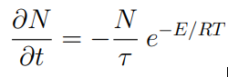{width=30%}

- $N$ — доля непрореагировавшего вещества $A$, меняющаяся от $1$ — исходное состояние, до $0$ — все прореагировало.
- $E$ — энергия активации $ХР$.
- $τ$ — характерное время перераспределения энергии. 
- $T$ — температура в данной точке.

## Размерная система уравнений
### Одномерный случай

В одномерном случае необходимо добавить уравнение теплопроводности с дополнительным членом, отвечающим за энерговыделение:

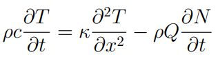{width=35%}

- $ρ$ — плотность, 
- $c$ — удельная теплоемкость.
- $κ$ — коэффициент теплопроводности.
- $Q$ — удельное энерговыделение при $ХР$.

## Размерная система уравнений
### Одномерный случай

В этой системе уравнений возможен режим в виде самостоятельно распространяющейся волны горения:

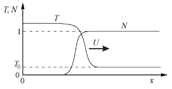{width=55%}

## Система уравнений для безразмерных величин

Поделив уравнение теплопроводности на $ρQ$ и перейдя к безразмерным температуре $T˜ = cT/Q$ и энергии активации $E˜ = cE/(RQ)$, получим систему уравнений:

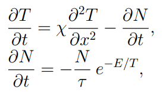{width=30%}

$χ$ = κ/ρc называется коэффициентом температуропроводности.

Из имеющихся в системе уравнений и трех параметров наиболее интересна безразмерная энергия активации $E$, равная отношению энергии активации к теплоте реакции. Именно этот параметр определяет режим волны горения, а остальные параметры $τ$ и $χ$ только масштабируют явление во времени и в пространстве.

## Различные режимы горения
### Одномерный случай

- Первый режим — скорость распространения волны постоянна, а профили температуры и концентрации переносятся вдоль оси $X$ не деформируясь.
- Второй режим — скорость волны переменная, и горение распространяется в виде чередующихся вспышек и угасаний. От значения параметра $E$, зависит какой режим реализуется.

## Различные режимы горения
### Двумерный случай

Для моделирования волны горения в двумерном случае в уравнение:

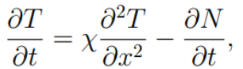{width=30%}

Нужно добавить перенос тепла по второй координате:

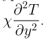{width=10%}

## Различные режимы горения
### Спиновое горение

Кроме стационарного и пульсирующего режимов для этой двухмерной системы возможен третий режим распространения волны горения — спиновый. При этом фронт состоит из нескольких зон горения, распространяющихся по винтовой линии
вдоль цилиндра.

{width=20%}

## Явная разностная схема 

Рассмотрим численные методы решения одномерного уравнения теплопроводности без химических реакций:

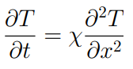{width=85}

Для этого в уравнении теплопроводности заменим частные производные на разностные:

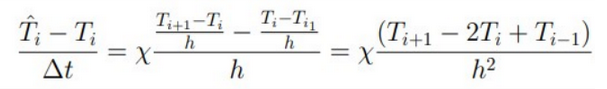{width=65%}

## Явная разностная схема

Теперь, чтобы учесть $ХР$, добавим к прошлой формуле изменение безразмерной температуры за счет энерговыделения в химических реакциях за шаг по времени:

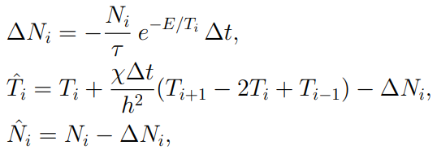{width=65%}

$i = 1, 2, . . . , n$

## Неявные разностные схемы

Явная схема, устойчива:

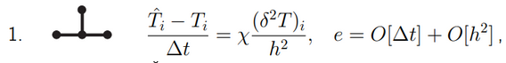{width=60%}

Неявная схема, всегда устойчива:

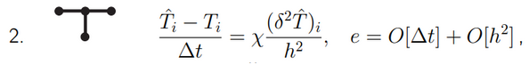{width=60%}

Неявная схема Кранка-Николсон, всегда устойчива:

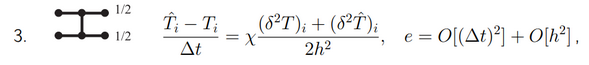{width=60%}

## Неявные разностные схемы

Преобразовав выражение для третьей схемы, получим систему n уравнений:

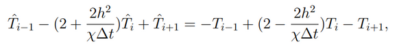{width=85%}

# Заключительная часть

## Результаты

Мы рассмотрели понятия теплопроводности и горения (детерминированного в том числе). Мы познакомились с понятиями, используемыми при изучении и построении уравнений теплопроводности и детерминированного горения.

## Источники

Медведев Д. А., Куперштох А. Л., Прууэл Э. Р., Сатонкина Н. П., Карпов Д. И. Моделирование физических процессов и явлений на ПК: Учеб. пособие / Новосибирск: Новосиб. гос. ун-т., 2010. — 101 с.
